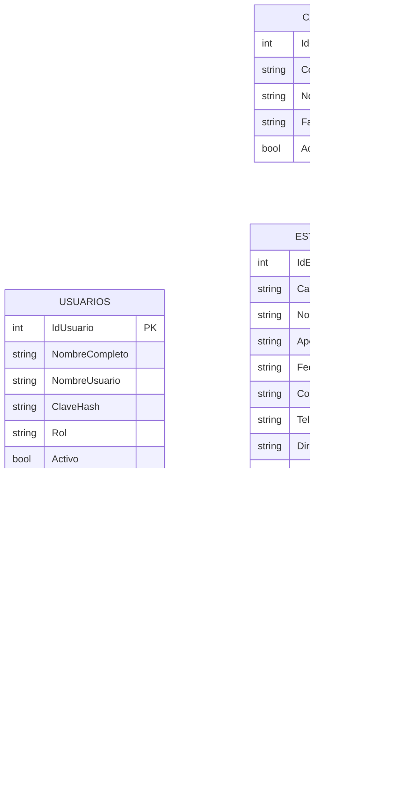

# Modelo relacional resumido

## Notas de uso

- `Estudiantes` es la entidad principal del sistema.
- `Carnet` debe ser único para evitar duplicados.
- La baja se manejará de forma lógica con el campo `Activo`.
- `MovimientosEstudiante` conserva trazabilidad de las acciones realizadas.
- El árbol binario de búsqueda sugerido por el proyecto puede construirse en memoria a partir de los datos persistidos en `Estudiantes`.
